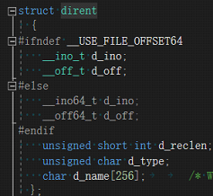
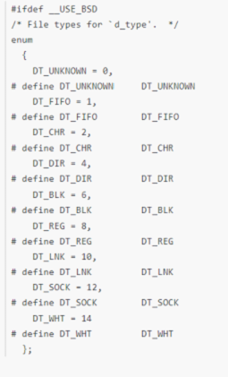
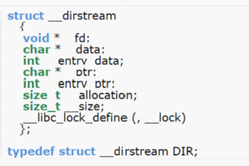
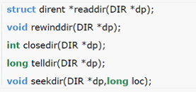

# Dirent:Linux下的文件结构体

## 简介

 最近因为程序要在linux下编译成功，但是无奈Linux系统下面没有#include<io.h>，也就没有finddata这个文件结构体，所以只能使用dirent这个结构体了，这里记录一下：

## 问题分析

  这是在源码中关于dirent的定义

​    

d_ino表示索引节点号，d_off表示在目录文件中的偏移，d_reclen则代表文件名的长度，d_type则代表文件类型，最后的name表示文件名。

其中d_type为一个数字，它代表了不同文件的类型，具体来说有如下类型

 

 

DT-UNKOWN表示未知的文件类型，DT_FIFO表示命名管道，DT_CHR表示字符设备，DT_DIR表示目录，DT_BLK表示块设备，DT_REG表示常规文件，DT_LINK则表示符号链接，DT_SOCK表示套接字。

 接下来是关于Dir的结构体

Dir结构体类似于FILE，是一个内部结构，以下几个函数用这个内部结构来保存当前正在被读取的目录的有关信息，函数Dir* opendir(const char* pathname),即打开文件目录，返回的是指向Dir的结构体指针，这个指针由以下函数共同使用：

Readdir的功能是读取该文件目录的下一个文件。

Reinddir用来设置参数dir,将目录流目前的读取位置设置到开头。

Closedir函数关闭与指针dir相联系的目录流，并释放相关资源。

telldir返回参数dir目录流目前的读取位置，此返回值代表距离目录文件开头的偏移量，有错误时返回-1.

seekdir用来设置dir目录流目前的读取位置，在调用readdir时便从这个位置开始读取，参数offset代表距离目录文件开头的偏移量.

## 问题解决方案

 如果想要遍历文件夹中的所有文件，第一步就是使用opendir函数打开目录A，并返回指向目录A的Dir结构体C。

 然后就可以调用readdir（C）函数读取目录A下的所有文件，并返回指向目录A下所有文件的dirent结构体D。如果想继续深层次遍历文件，则对找到的目录继续调用opendir。

 最后执行closedir，释放资源.

## 问题总结

Liunx与Windows下的文件查找方式还是有很大区别的，要注意根据系统来编写程序

