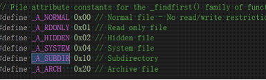

# Finddata.attrib 

## 简介

最近在代码里面使用finddata结构体判断文件属性时用了 = ，但是这样判断局限性比较小，只能判断单一的文件属性，如果想查找多重属性的文件根本行不通。查阅网上资料还有 & 符号判断文件属性。

## 问题分析

 首先是关于attrib的各种属性值

这些数据都是十六进制的，在二进制下这些值都是2的n次方。从网上资料得知，可以通过位或的方式得到文件的综合属性，比如说文件+隐藏就是_A_SUBDIR|_A_HIDDEN。

## 问题解决方案

 我进行了测试，在原来的文件夹里面加入了一个隐藏文件夹，并输出每个文件的attrib，

结论是其余普通文件的attrib的值为16，隐藏文件的attrib为18，正好是_A_SUBDIR|_A_HIDDEN的值，所以如果只是’=‘符号只能获取同时含有这两个属性的文件，而’&‘ 符号可以获取任意包含其中属性的文件。

## 问题总结

 关于’=‘与’&‘判断文件的方式有很大区别，要根据情况选择，不能盲目使用’=‘或’&‘符号。