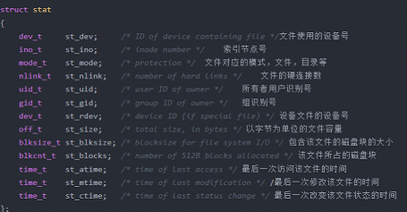
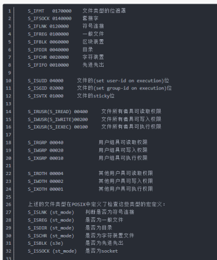
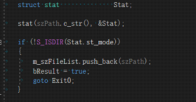

#  Linux下fopen打开文件的问题

## 简介

 最近因为代码要在Linux下调试编译通过，所以在遍历文件夹文件的基础上增加了Linux的遍历文件方式，与Windows下一样，第一步判断此路径是否是文件还是文件夹，但是在fopen的时候发现在Linux下无论文件还是文件夹都能顺利打开，这就会造成问题，在这记录一下。

## 问题分析

 翻阅了资料，发现了Linux下一切皆文件。普通文件，目录，字符设备，块设备和网络设备都在Linux/Unix下当作文件来看待，虽然他们的类型不同，但是Linux系统为他们提供了一套统一的操作接口。

  这就解释了为什么fopen能打开Linux下的文件夹而不会报错。

## 问题解决方案

接下来就是去解决Linux下判断文件还是文件夹的问题。Linux下有个关于文件的结构体stat,这是stat的有关数据

 

 可以从stat的set_mode来查看文件的具体属性。

可以直接通过S_ISDIR来判断是不是文件夹，下面是具体的执行代码：

这样问题就解决了。

## 问题总结

在Linux下编写C++程序时对于文件操作函数要使用小心，毕竟在Linux下一切皆文件，任何文件都能打开，容易造成不确定性。