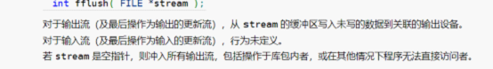
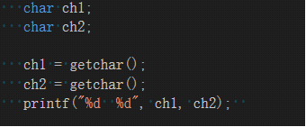
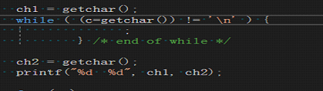
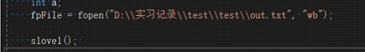
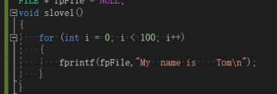

# fflush的作用

## 简介

最近在代码加入了fflush这个函数，但是删除了之后发现没什么变化，但是fflush这个函数应该是有存在的意义，所以特地记录一下。

## 问题分析

下面是关于fflush在MSDN上的定义：

fflush的返回类型是int型，如果成功刷新,fflush返回0。指定的流没有缓冲区或者只读打开时也返回0值。返回EOF指出一个错误。

fflush一般有两种用法，一种是ffush(stdin),还有一种是fflush(out)

经过资料查询，fflush(stdin)的作用是刷新标准输入缓冲区，并将数据缓冲区的数据全部清空。因为我们从键盘输入的所有字符都暂时存放在缓冲区，而当调用scnaf，getchar等函数时计算机是直接从缓冲区读取数据，有时候不一定是键盘输入的数据，这个时候就有必要清空输入缓冲区。

## 问题解决方案

于是模拟了下缓冲区数据多余的情况，但是经过测试证明ffush(stdin)在windows上不起作用，这是一段测试代码

这段代码意思很简单，从键盘输入两个字符并输出两个字符的ascll码，如果我输入两个a，则会输出97 97，但实际上我只输入了一个a再输入回车就输出了97 10，其中10是换行的ascll码，getchar的功能是从输入缓冲区读取下一个字符，当输入a在按下回车时，输入缓冲区实际有了'a'与'\n'两个字符，所以ch1变成了'a'，ch2变成了'\n'实际上一行连续输入两个a就能获取想要的结果，但有时候我们并不想一行输入多个字母而是一行一个字母，

这个时候最好的办法是输入完回车之后，清空输入缓冲区。但是在ch1与ch2之间加入fflush(stdin)是没有效果的，如果想清空缓冲区要手动添加代码

## 这样能清除缓冲区的换行符。

由此可见，fflush（stdin）是不正确的，在MSDN的描述上也没有对于输入流的定义，所以fflush(stdin)最好不要使用。

 fflush(stdout)功能是强制刷新标准输出缓冲区，把输出缓冲区的功能打印到标准输出设备上，如果不使用该函数且缓冲区未满，则数据会一直存储在输出缓冲区，即使程序关闭也不会将数据传输到目标文件。

 以下是测试程序：

该程序是向out.txt文件输入一百行字符串，如果不使用ffush(fpfile)或fclose，数据会一直在缓冲区，直到缓冲区满，如果未满则无法输入到文件，在调用了fflush(fpfile)或fclose之后成功传输到文件。

## 问题总结

 如果遇到输入数据异常的问题，不妨利用fflush来尝试解决，可能是因为缓冲区数据未清空而造成输入异常的问题，对于输出来说，最好在每次将数据输出到文件时清空缓冲区，否则这样即使程序异常中断数据也不会丢失。