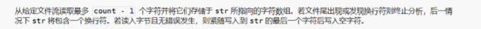

# 关于fgets的一点理解

## 简介

 开发过程中碰到fgets的边界问题，回去查了资料fgets确实有比较大的局限性，加上行的大小不确定，可能读取的过程中会有读不完全的情况，所以就舍弃了这个函数。

## 问题分析

 在分块读取文本时，因为涉及到对块的最后一行读取不完整，所以一开始采用fgets对不完整的那一行进行读取，首先查阅MSDN与源码，得到fgets 的参数与定义

首先给定的参数为count,但是实际最大读取个数为count-1(包括换行符),比较容易造成歧义，然后如果文件出现换行符，那么得到的字符最后也会有换行符，要比较小心，再者就是读取的文档行的大小不确定，无法确定读取的最大字节。

## 问题解决方案

 最后我做了一个测试来验证正确性，我写了一行1024个字节的文档除了最后一个是2其他都是1，并写了测试代码：

输出结果为空，但把倒数第二个1改成2并输出s[1022]，那么结果就是为2，与源码和MSDN的描述一致。 

## 问题总结

 最终因为不确定行的大小，我放弃了fgets这个函数，修改成每次读完一个BUFFER_SIZE之后从该点往前遍历寻找换行符，找到后移动文件指针，将指针位置停留在寻找到的换行符处，这样就解决了因为行的大小不确定造成的读不完全的情况。