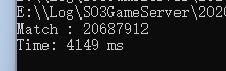
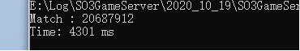

#   关于future.wait的一点理解:

## 简介

由于之前在代码里面加入了future.wait这个函数出现了宕机问题，我重新试了下，发现同样逻辑的代码并没有出现宕机问题(盲猜那个时候编译器有问题)。

## 问题分析

​    后来重新查阅了有关future的函数，这是MSDN上的有关分析：

换句话说就是在函数的结果变得可用之前会一直执行wait函数，然后我又查了future.get函数，这是截取MSDN的定义：

使用future.get等效于先调用future.wait再调用future.get。对于程序效率来说并没有太大的区别。

## 问题解决方案

   我选取了同样的数据，这是测试记录：

 首先是写了wait的代码

 然后就是不写wait的代码

##    问题总结

从时间来看两者效率相差不大，验证了之前提到的结论。其实关于多线程，future还有很多可以深究，今天先到这，剩下以后去探究。