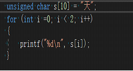
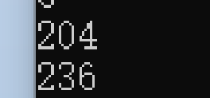
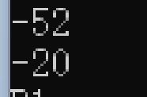
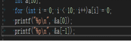
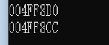

# 关于数组下标为负数的情况

## 简介

  最近在代码中使用了Sunday算法，这种算法相比与Bm算法少了对好后缀的特判，同时也带来一个问题：如果坏字符为半个汉字，那么它在坏字符数组中表示的索引就是负数，有可能会造成非常严重的后果。所以在这里记录一下。

## 问题分析

 首先ASCLL 定义0-127的128个数字所代表的英文字母或一样的结果与意义，由于用7个比特位就可以表示从0-127的数字，大部分的电脑都使用8个位来存取字元集，所以从128-255之间的数字可以代表另一个128个符号，称为extended ASCLL。

 我测试了一下，半个汉字的ascll码范围确实是在128-255。

但是如果用char类型来表示汉字，那么就会出现负数。

这就是数组下标会出现负数的原因。

## 问题解决方案

  继续对数组下标为负数的情况做分析，在我原来的认知里面如果数组下标出现了负数，那么连编译都不会通过，但比较神奇的是编译不但通过还输出了一个比较大负数

查看了a[-1]与a[0]的地址，发现这两个地址是连续的：

究其原因a[-1]代表的是a[0]前一个地址代表的值，这就解释了为什么数组下标是负数时程序不会宕机，有时候还能正确跑过的原因。

## 问题总结

   这种错误非常隐蔽，因为不会产生宕机有时候还有可能输出正确的值，所以非常不容易查找，写程序要尽量避免犯这种错误。