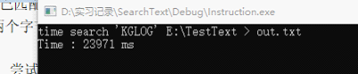

# 文本模式与二进制模式的写入效率

## 简介

写代码的时候有一处地方没有多想写了fopen(xxx.txt,"w")，后来对比grep的写入速度发现差距巨大。

## 问题分析

猜测是由于输出模式的问题，然后做了个测试，对比一模一样的模式串

这是二进制模式下的输出时间

这是文本模式下的输出时间

## 问题总结

可以看到时间差距巨大，原因在于二进制模式下写入文本时数据是原封不动写进去的，而用文本模式写入时，会对\n做出判断并将\n转化为\r\n,大大降低了效率。所以直接使用了二进制输出模式。