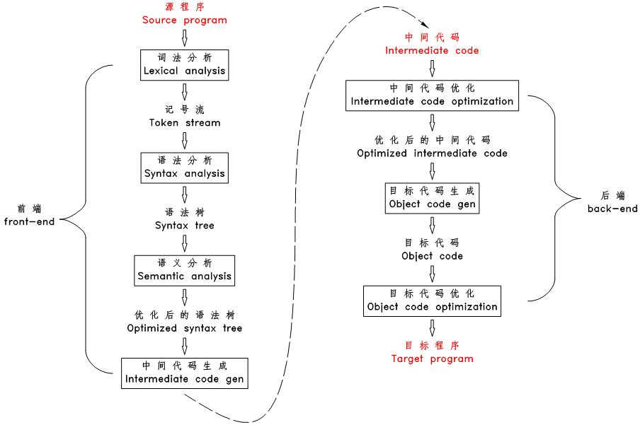
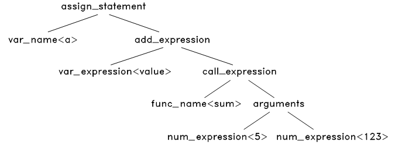

#                     初步学习编译，链接，及装载

在实习过程中，因为提出了编译的问题，所以在这边记录一下，为了方便记录，我在Linux上自创了一个名为main.cpp的C++ 程序。

## 编译

其中编译分为三个阶段：预编译，编译，汇编。

### 预编译：

main.c ->main.i

在Linux的终端下输入命令: g++ -E main.cpp -o main.i,获得main.i文件，打开main.i文件查看

```c
# 1 "main.cpp"
# 1 "<built-in>"
# 1 "<command-line>"
# 1 "/usr/include/stdc-predef.h" 1 3 4
# 1 "<command-line>" 2
......
 167 "/usr/include/c++/9/bits/stl_algobase.h" 3
  template<typename _ForwardIterator1, typename _ForwardIterator2>
    _ForwardIterator2
    swap_ranges(_ForwardIterator1 __first1, _ForwardIterator1 __last1,
  _ForwardIterator2 __first2)
    {
      ;

      for (; __first1 != __last1; ++__first1, (void)++__first2)
 std::iter_swap(__first1, __first2);
      return __first2;
    }
```

这里截取了main.i文件的一小部分，实际上的main.i文件比起源文件而言非常臃肿，是因为预编译时会做如下事情。

1.宏定义展开：将所有'#define' 删除，并展开所有宏定义。

2.处理所有条件预编译指令，比如 "#if" ,"ifdef"等

3.头文件的展开：处理"#include"预编译指令，这包括C/C++ 库的头文件也包括自定义的头文件，将头文件中定义的函数及类都加入到它所产生的输出文件中，以供编译程序对之处理。这就是为什么main.i代码显得比较臃肿的原因。

### 编译

main.i  -> main.s

在Linux下输入命令 g++ -S main.i -o main.s，获得main.s文件，打开main.s文件查看

```c
LFB364:
	.cfi_startproc
	endbr64
	pushq	%rbp
	.cfi_def_cfa_offset 16
	.cfi_offset 6, -16
	movq	%rsp, %rbp
	.cfi_def_cfa_register 6
	movq	%rdi, -8(%rbp)
	movq	%rsi, -16(%rbp)
	movq	-16(%rbp), %rax
	popq	%rbp
	.cfi_def_cfa 7, 8
	ret
	.cfi_endproc
.LFE364:
......
```

可以看到几乎都是汇编语言，编译的过程就是把预处理完的文件进行一系列词法分析，语法分析，语义分析，再进行中间代码的优化，才生成汇编代码。



从网上复制了一张图，基本展示了编译器的工作流程。

首先对源文件的进行扫描，将源文件的字符流拆分成一个个的词，此为词法分析，举个例子

```c
a = value + sum(5, 123);
```

被拆成11个token:

```
a           标识符
=           赋值运算符
value       标识符
+           加号
sum         标识符
(           左括号
5           整数
,           逗号
123         整数
)           右括号
;           分号
```

语法分析

词法分析完毕之后，上面的字符就变成token流了

```c
ID<a> '=' ID<value> '+' ID<sum> '(' NUM<5> ',' NUM<123> ')' ';'
```

上面的ID<a>表示这是一个标识符类型，其内容为 a。

接下来根据语法规则解析token流，在TinyC中只有四种语句:赋值语句，函数调用语句,if与while语句，把这四种语句的语法结构与上文的token流比对，只有赋值语句才吻合


将源程序的等号两边的内容放到该语法结构树的对应节点上，生成语法树


第二步继续对expresion<value + sum(5,13)>进行解析，包括：变量表达式、数字表达式、加法表达式、减法表达式等等。经过对比，发现只有加法表达式的结构才能匹配这个 <value + sum(5, 123)>，于是将加法表达式的语法结构应用到此表达式上，生成：


继续对该语法树进行拆分：


拆分完了之后，就可以对语法树进行优化了，有些节点是可以去掉了，比如'=' 与 ';',因为我们已经知道这是一个赋值表达式，所i这两个节点可以不要了，最终得到这样一棵语法树：



语法树生成完毕之后，编译器开始对语法树进行一次或多次的遍历，检查语义规则，在上个赋值语句中需检查：

1.变量与函数是否被声明过。

2.sum函数的参数数量及类型是否与其声明的参数数量及类型匹配。

3.‘+’运算符两边的操作数的类型是否匹配(value与sum的返回值类型是否相等)。

4.‘=’运算符两边的操作数类型是否匹配。

一般来说，在遍历语法树的时候，遇到声明的变量与函数，则会将变量名 - 类型，函数名 - 返回类型 -参数数量及类型保存到一张符号表里面，当再次遇到变量及函数时，就直接在符号表中进行查找，查找该名称是否被声明，该名称的类型是否被正确使用。

语言检查时，也会对语法树进行一些优化
例如

```c
a = 1 + 2 * 9;
会变成
a = 19;
```

之后生成中间代码，其实就是汇编语言，这种既有部分高级语言的特性，又有接近机器语言操作的中间代码。

还是以上述语句为例，首先从根节点assign_statement开始，一步步解析，最终形成汇编代码

```c
push value
push 5
push 123
$sum
add
pop a
```

之后再对中间代码进行优化，常见的方式有：

1.去掉永远不会执行的代码区

2.去掉未被使用的变量

3.将循环体中运行结果不变的语句移到外面

4.算术表达式优化，将乘1，加0的操作去掉等等。

全部优化完之后，就是目标代码的生成了，最终形成汇编代码。

### 汇编

编译完之后，就将汇编代码变成机器可以执行的指令，每一条汇编语句都对应一条机器指令，在Linux的终端上输入指令g++ -c main.s -o main.o 即可得到源代码编译后，未进行链接的中间文件

.o的文件类型为ELF类型，Linux下ELF类型的文件有.o文件（可重定位目标文件），可执行文件，核心转储文件以及.so文件（动态链接库）

首先了解一下ELF的文件结构


#### 文件头（File Header）

描述了整个文件的文件属性，包括目标文件是否可执行、是静态链接还 是动
态链接及入口地址、目标硬件、目标操作系统等信息、段表（描述文件中各
个段的偏移位置及属性等）

#### 代码段(.text)

存放了程序源代码编译之后生成的机器指令。

#### 数据段（.data）

存放已初始化的全局静态与非静态变量和已初始化的局部静态变量

#### .bss

存放未初始化的全局变量和局部静态变量，但是.bss段也只是为这些变量预留位置，并没有内容，所以这些变量在.bss短也不占空间。

用objdump -h main.o指令打开 main.o文件

```
name          Size      VMA               LMA               File off  Algn
0 .group        00000008  0000000000000000  0000000000000000  00000040  2**2
                  CONTENTS, READONLY, GROUP, LINK_ONCE_DISCARD
  1 .group        00000008  0000000000000000  0000000000000000  00000048  2**2
                  CONTENTS, READONLY, GROUP, LINK_ONCE_DISCARD
  2 .group        00000008  0000000000000000  0000000000000000  00000050  2**2
......
74 .text         00000605  0000000000000000  0000000000000000  00000358  2**0
                  CONTENTS, ALLOC, LOAD, RELOC, READONLY, CODE
 75 .data         00000000  0000000000000000  0000000000000000  0000095d  2**0
                  CONTENTS, ALLOC, LOAD, DATA
 76 .bss          00000018  0000000000000000  0000000000000000  00000960  2**4
                  ALLOC
 77 .rodata       00000077  0000000000000000  0000000000000000  00000960  2**3
                  CONTENTS, ALLOC, LOAD, READONLY, DATA
 78 .text._ZnwmPv 00000016  0000000000000000  0000000000000000  000009d7  2**0
......
154 .comment      0000002b  0000000000000000  0000000000000000  00001da0  2**0
                  CONTENTS, READONLY
155 .note.GNU-stack 00000000  0000000000000000  0000000000000000  00001dcb  2**0
                  CONTENTS, READONLY
156 .note.gnu.property 00000020  0000000000000000  0000000000000000  00001dd0  2**3
                  CONTENTS, ALLOC, LOAD, READONLY, DATA
157 .eh_frame     00000a28  0000000000000000  0000000000000000  00001df0  2**3
                  CONTENTS, ALLOC, LOAD, RELOC, READONLY, DATA

```

里面的段还是非常多的包括.comment：注释信息段。

.rodata:只读数据段

.node.GUN-stack :堆栈提示段

列：

Name ：段名字

Size：段的长度

File off：段所在的位置（即距离头文件的偏移距离)

段的属性：

CONTENTS :表示该段在文件中存在

ALLOC：表示只分配了大小，但没有存内容。

## 链接

连接是将各种代码和数据片段收集并组合成一个单一文件的过程，这个文件可以被加载到内存并执行。

### 静态链接

像Linux LD程序这样的静态链接器以一组可重定位目标文件和命令行参数作为输入，生成一个完全链接的、可以加载和运行的可执行目标文件作为输出。为了达到这个目的，链接器必须完成三个主要任务：

1.地址与空间分配

2.符号解析

3.重定位

在我们得到的可执行文件中的段是由之前目标文件中的节合并而来，比较常用的方式是合并相同性质的节，比如：将所有目标文件的.text节合并到输出文件的text段


这种做法的好处是比较省内存，因为每个节都需要一定的地址和空间对齐要求，x86硬件的对其要求是4KB，如果没有按相同性质的节分配就会造成内存碎片。这一步完成之后我们就能获得各个节的长度，属性，位置等，并将目标文件的符号表中所有的符号定义和符号引用收集起来，统一放到全局的符号表。

合并完之后变成如下表


多出了一个Program Header Table ：将连续的文件节映射到运行时内存段，

在Linux上写了a.c与b.c两个C程序

```c
/ a.c
extern int shared;

int main() {
    int a = 100;
    swap(&a, &shared);
}
```

```c
// b.c
int shared = 1;

void swap(int *a, int *b) {
    *a ^= *b ^= *a ^= *b;
}
```

使用gcc命令得到 a.o与b.o文件，接着我们将a.o与b.o链接起来，输入命令 gcc a.o b.o -o c.o,得到c.o,我们使用odjdump查看链接前后的地址分配

```c
//c.0
15 .text         00000205  0000000000001060  0000000000001060  00001060  2**4
......
24 .data         00000014  0000000000004000  0000000000004000  00003000  2**3
                  CONTENTS, ALLOC, LOAD, DATA
 25 .bss          00000004  0000000000004014  0000000000004014  00003014  2**0
```

```c
//a.o
0 .text         00000055  0000000000000000  0000000000000000  00000040  2**0
                  CONTENTS, ALLOC, LOAD, RELOC, READONLY, CODE
  1 .data         00000000  0000000000000000  0000000000000000  00000095  2**0
                  CONTENTS, ALLOC, LOAD, DATA
  2 .bss          00000000  0000000000000000  0000000000000000  00000095  2**0
   ......
```

```c
//b.o
0 .text         0000004f  0000000000000000  0000000000000000  00000040  2**0
                  CONTENTS, ALLOC, LOAD, READONLY, CODE
  1 .data         00000004  0000000000000000  0000000000000000  00000090  2**2
                  CONTENTS, ALLOC, LOAD, DATA
  2 .bss          00000000  0000000000000000  0000000000000000  00000094  2**0
    ......
```

在没有链接之前，所有的虚拟内存地址都是0，链接之后，可执行文件的各个节都被分配到了相应的虚拟地址，如.text节分配到 0000000000001060。这样a.c在调用shared与swap的时候才能顺着地址从b.c中找到数据与函数。

除此之外，还提供了三个表：未解决符号表、导出符号表、地址重定向表。

1. 未解决符号表提供了所有在该编译单元里引用但是定义并不是在本编译单元的符号以及其出现的地址；
2. 导出符号表提供了本编译单元具有定义，并且愿意提供给其他单元使用的符号及其地址；
3. 地址重定向表提供了本编译单元所有对自身地址的引用的记录；

### 动态链接

但是静态链接的程序有任何更新。都必须重新编译程序用户则需要重新下载安装该程序。为了解决这个方法，才有了动态链接。

与静态链接不同，动态链接不是在编译的时候链接的，而是在运行的时候才链接的，当程序被装载时，系统的动态链接器会将程序所需要的所有动态链接库装载到进程的地址空间，并将程序中所有未解析的符号绑定到相应的动态链接库中，并进行重定位。

## 总结：

关于编译，链接的细节还有很多，现在只是列出了一个大概，剩下的细节之后再去研究了。