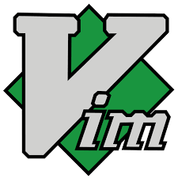
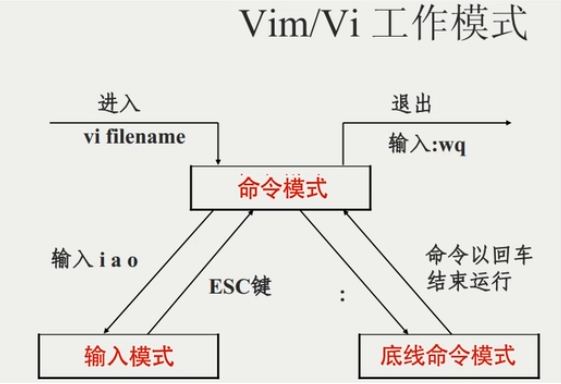

# vim快速入门

## 1.`vim`是什么东西？

Vim是从Vi发展出来的一个文本编辑器。代码补全、编译及错误跳转等方便编程的功能特别丰富。

## 2.`vim`的使用

基本上`vim`分为三种模式，分别是命令模式(Command mode)、输入模式(Insert mode)和底线命令模式(Last line mode)。

### 命令模式

用户刚刚启动vim，便进入命令模式

### 输入模式

在命令模式按 i 就可以进入输入模式

按`ESC`，退出输入模式，进入命令模式

### 底线命令模式

在命令模式下按 : 就进入底线命令模式
底线命令模式可以输入单个或者多个字符的命令，可用的命令非常多。
在底线命令模式中，基本的命令有：

- q 退出程序
- w 保存文件
- q! 不保存并退出

按`ESC`可退出底线命令模式

### 常见的命令

#### 光标的移动

h, j, k, l分别控制光标左、下、上、右移一格。

w：光标跳到下个字的开头。
e：光标跳到下个字的字尾。
b：光标回到上个字的开头。

`ctrl+b`：屏幕往后移动一页。
`ctrl+f`：屏幕往前移动一页。
`ctrl+u`：屏幕往后移动半页。
`ctrl+d`：屏幕往前移动半页。

`gg`：移动到文本的开头。
   G：移动到文件的最后。

数字 0：移动到光标所在行的行首。
        $：移动到光标所在行的行尾。

#### 撤销

`u` 撤销上一次的操作

#### 复制

`yy` 复制当前光标所在的那一行

p 将已复制的数据在光标下一行粘上
P 将已复制的数据在光标上一行粘上

#### 删除

`x`   删除光标后一个字符
`X`   删除光标前一个字符
`dd` 删除光标所在的那一行

#### 替换

 `:1,$s/word1/word2/g` 或者 `:%s/word1/word2/g` 从第一行到最后一行寻找`word1`字符串，并将该字符串取代为`word2`字符串

#### 搜索

/ 正向搜索

?反向搜索

n下一个搜索结果

N上一个搜索结果

## 3.环境变更

`:set nu`		显示行号，设定之后，会在每一行的前缀显示该行的行号
`:set nonu`	与`:set nu`相反，取消行号

`:set mouse=a` 设置鼠标可以指定光标所在的位置